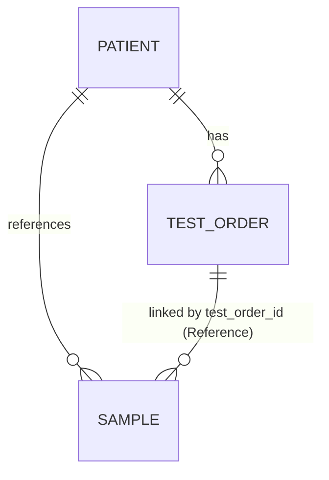

# Database Design Specification

Tài liệu này chi tiết cấu trúc các collection và các mối quan hệ dữ liệu trong hệ thống Firestore.

## 1. Core Collections

### 1.1. test_orders
Lưu trữ các yêu cầu xét nghiệm di truyền.
- **Fields:**
    - `id` (string): Document ID.
    - `patient_id` (string): Path dẫn đến document của bệnh nhân (VD: "/patients/PAT_001"). **Đây là field chính để liên kết với Sample và Patient.**
    - `patient_name` (string): Tên bệnh nhân (denormalized).
    - `patient_code` (string): Mã số bệnh nhân (VD: "PAT_001").
    - `status` (string): Trạng thái phiếu (PENDING, ANALYZING, WAITING_APPROVAL, COMPLETED, REJECTED).
    - `specialist_id` (string): UID của chuyên viên được giao.
    - `created_at` (timestamp): Thời gian tạo phiếu.

### 1.2. samples
Lưu trữ thông tin mẫu bệnh phẩm.
- **Fields:**
    - `id` (string): Document ID.
    - `test_order_id` (Reference): Tham chiếu đến document trong collection `test_orders`. **Đây là field chính để liên kết Sample với TestOrder.**
    - `patient_id` (Reference): Tham chiếu đến document trong collection `patients` (phụ, dùng cho hiển thị).
    - `sample_type` (string): Loại mẫu (VD: "Máu ngoại vi").
    - `status` (string): Trạng thái mẫu (collected, culturing, harvested, failed).
    - `collected_at` (timestamp): Thời gian thu nhận mẫu.
    - `notes` (string): Ghi chú chuyên môn cho mẫu bệnh phẩm.
    - `updated_at` (timestamp): Thời gian cập nhật cuối cùng.

### 1.3. patients
Lưu trữ thông tin hành chính của bệnh nhân.
- **Fields:**
    - `id` (string): Document ID (VD: "PAT_001").
    - `full_name` (string): Họ và tên.
    - `dob` (timestamp): Ngày sinh.
    - `gender` (string): Giới tính (male/female).

## 2. Entity Relationships

### Lưu ý quan trọng về liên kết:
- Field `test_order_id` trong collection `samples` là kiểu **Firestore Reference** (không phải String).
- Để tìm `Sample` của một `TestOrder`, query: `.where('test_order_id', isEqualTo: firestore.doc('test_orders/$orderId'))`.
- **KHÔNG dùng `patient_id`** để truy vấn sample từ order — đây là quan hệ phụ chỉ dùng cho hiển thị thông tin bệnh nhân.

## 3. Sub-collections (AI Analysis)

### 3.1. test_orders/{orderId}/metaphase_images
- Lưu danh sách các ảnh metaphase đã upload.
- Mỗi document chứa: `raw_image_url`, `status` (UPLOADED, PROCESSED), `processed_at`.

### 3.2. .../metaphase_images/{imageId}/chromosomes
- Lưu danh sách các nhiễm sắc thể được cắt ra từ ảnh.
- Chứa tọa độ (`x`, `y`), `index`, và kết quả phân loại từ AI.
