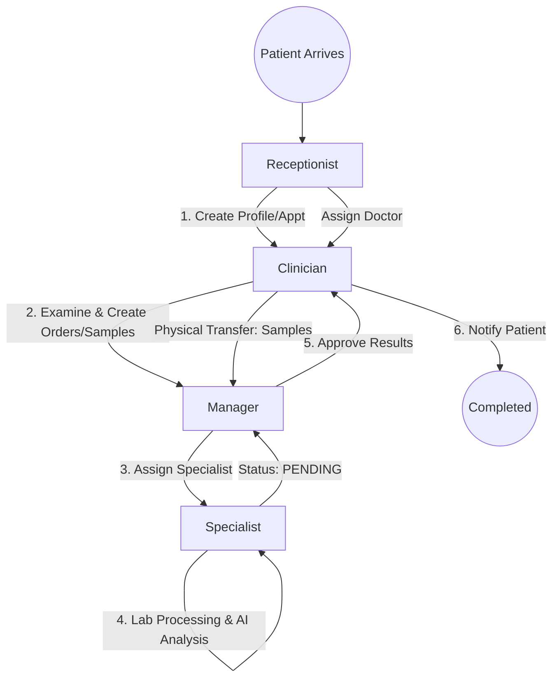

# Business Workflow and Data Flow
The AI Chromosome App revolves around a 6-stage workflow coordinating four main roles: Receptionist, Clinician, Manager, and Specialist.

## Roles & Responsibilities
1. **Receptionist**: Creates patient profiles and schedules appointments. Assigns patients to clinicians.
2. **Clinician**: Conducts examinations, creates genetic test orders, collects physical samples (labeled with QR codes), and transfers them to the Lab.
3. **Manager (Lab)**: Receives orders/samples, assigns them to Specialists, and approves the final Karyotyping results.
4. **Specialist**: Handles lab procedures (culturing, harvesting), utilizes AI tools for Karyotyping, finalizes the ISCN formula, and submits for approval.

## Status Transitions
- **Appointments**: `scheduled` -> `completed`
- **Samples**: `COLLECTED` -> `CULTURING` -> `HARVESTED` (or `FAILED`)
- **Test Orders**: `WAIT_ASSIGN` -> `CULTURING` -> `ANALYZING` -> `PENDING_APPROVAL` -> `COMPLETED`

## Automated State Management (Cloud Functions)
- **Assign Specialist**: `test_orders` -> `CULTURING`
- **Start Culturing**: `samples.status = CULTURING` -> `test_orders` -> `CULTURING`
- **AI Counting/Imaging**: `metaphase_images` updated -> `test_orders` -> `ANALYZING`
- **Specialist Submit**: `test_orders` -> `PENDING_APPROVAL`
- **Manager Approve**: `test_orders` -> `COMPLETED` (Generates PDF report)

## Exception Handling
- **Failed Culture**: If a sample fails, the system alerts the Clinician to recollect. The order is suspended until a new sample is provided.
- **Approval Rejection**: If the Manager rejects, the order reverts to `ANALYZING` for the Specialist to correct.

## Workflow Diagram

