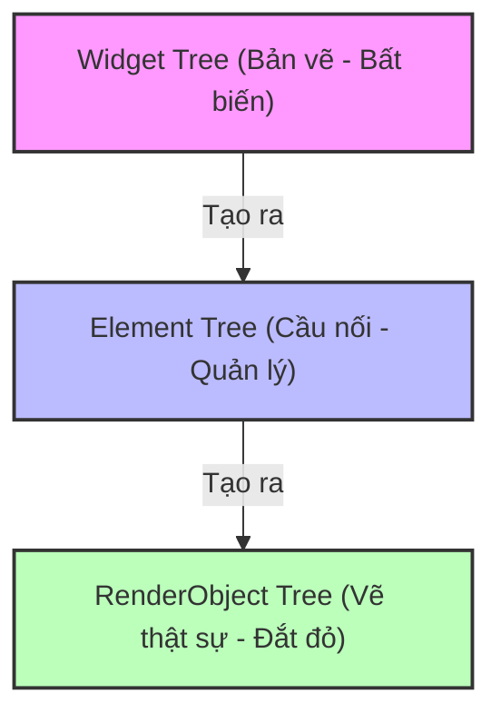

# Cơ chế 3 Cây trong Flutter (Widget - Element - RenderObject)

## 1. Khái niệm cơ bản
Một trong những lý do giúp Flutter có hiệu năng cực cao là nhờ cơ chế quản lý giao diện thông qua **3 loại cây** (Trees) khác nhau thay vì chỉ dùng 1 cây DOM như web truyền thống.

Giám khảo rất hay hỏi câu này để kiểm tra xem bạn có hiểu cách Flutter vẽ giao diện hay không.

---

## 2. Chi tiết về 3 loại cây

### 🌳 1. Widget Tree (Cây Widget)
- **Vai trò**: Là bản vẽ thiết kế (Blueprint) của giao diện.
- **Đặc điểm**:
  - **Immutable** (Bất biến): Khi một Widget cần thay đổi, Flutter không sửa nó mà sẽ hủy đi và tạo một Widget mới thay thế.
  - **Rất nhẹ và rẻ**: Việc tạo mới Widget diễn ra liên tục nhưng không tốn nhiều tài nguyên vì nó chỉ chứa các thông số cấu hình (như màu sắc, kích thước).
- **Ví dụ**: `Container`, `Text`, `Row`.

### 🌿 2. Element Tree (Cây Element)
- **Vai trò**: Là người quản lý (Manager) và là cầu nối giữa Widget và RenderObject.
- **Đặc điểm**:
  - **Mutable** (Có thể thay đổi): Nó giữ lại vị trí của Widget trên màn hình và quản lý vòng đời của Widget đó.
  - Nó biết Widget nào tương ứng với RenderObject nào.
  - Khi Widget bị hủy và tạo mới, Element sẽ so sánh xem Widget mới có cùng "kiểu" (Type) và "Key" với Widget cũ hay không. Nếu có, nó chỉ cập nhật tham chiếu chứ không tạo lại RenderObject. Đây chính là bí quyết giúp Flutter mượt mà!

### 🌲 3. RenderObject Tree (Cây RenderObject)
- **Vai trò**: Là người trực tiếp vẽ (Draw) và tính toán kích thước, vị trí trên màn hình.
- **Đặc điểm**:
  - **Rất nặng và đắt đỏ**: Việc tạo mới RenderObject tốn nhiều tài nguyên tính toán. Vì vậy Flutter luôn cố gắng tái sử dụng nó tối đa nhờ sự điều phối của Element Tree.
- **Ví dụ**: `RenderParagraph` (vẽ text), `RenderFlex` (vẽ Row/Column).

---

## 3. Sơ đồ hoạt động



---

## 4. Ví dụ thực tế khi UI thay đổi
Giả sử bạn có một `Text('Hello')` và sau đó đổi thành `Text('World')`:
1. **Widget Tree**: `Text('Hello')` bị hủy. Một `Text('World')` mới được tạo ra.
2. **Element Tree**: Nhận thấy Widget mới vẫn là kiểu `Text`. Nó giữ nguyên Element cũ và chỉ bảo RenderObject cập nhật lại nội dung hiển thị.
3. **RenderObject Tree**: Không bị tạo lại. Nó chỉ vẽ lại chữ 'World' thay cho chữ 'Hello' trên màn hình.

➡️ **Kết luận**: Nhờ cơ chế này, Flutter không phải tính toán lại bố cục (Layout) từ đầu, giúp ứng dụng đạt mượt mà 60fps - 120fps!

---

## 5. Ứng dụng thực tế trong dự án (Tối ưu hóa với `const`)

Trong dự án của chúng ta, cơ chế này được ứng dụng triệt để để tối ưu hiệu năng, cụ thể là việc sử dụng từ khóa `const` cho các Widget tĩnh.

**Ví dụ trong file `lib/presentation/widgets/shared/navigation/main_shell.dart`:**
```dart
        children: [
          // Left: Side Rail
          if (!isWorkspace) const AppSideRail(), // ➡️ Tối ưu bằng const

          // Right: Content Area (Header + Main Page)
          Expanded(
            child: Column(
              children: [
                // Top: Rich Header
                const AppHeader(), // ➡️ Tối ưu bằng const

                // Bottom: Actual screen content
                Expanded(child: child),
              ],
            ),
          ),
```

**Giải thích cơ chế tối ưu:**
- **Khi KHÔNG dùng `const`**: Mỗi lần `MainShell` rebuild, Flutter tạo mới `AppSideRail` và `AppHeader`. Element Tree phải duyệt và so sánh.
- **Khi CÓ dùng `const`**: Flutter tạo instance duy nhất ở compile-time. Khi `MainShell` rebuild, Element Tree thấy instance hoàn toàn giống hệt nhau (cùng con trỏ) nên **dừng lại ngay lập tức**, không duyệt hay vẽ lại nhánh cây bên dưới.
- ➡️ **Kết luận**: Giúp giảm tải cho CPU và giữ FPS luôn ở mức cao (60-120fps).

---
Tài liệu này giúp bạn trả lời câu hỏi phỏng vấn/bảo vệ về "Flutter Rendering Pipeline".
