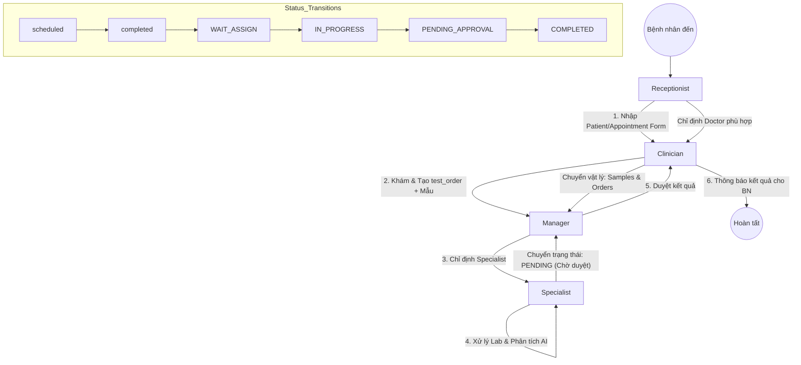

# Luồng Dữ Liệu & Quy trình Nghiệp vụ (Data Flow & Business Workflow)

Hệ thống quản lý xét nghiệm Di truyền (AI Chromosome App) được thiết kế xoay quanh quy trình phối hợp giữa 4 vai trò chính, đảm bảo tính nhất quán từ khâu tiếp nhận đến khâu trả kết quả.

---

## 1. Sơ đồ luồng nghiệp vụ (Workflow Diagram)

Sơ đồ dưới đây mô tả sự tương tác giữa các vai trò và sự chuyển đổi trạng thái của dữ liệu:

---

## 2. Chi tiết vai trò và Dữ liệu (Roles & Data Responsibilities)

### 2.1. Tiếp nhận (Receptionist)
*   **Hành động:**
    *   Tiếp nhận bệnh nhân, tạo hồ sơ (`patients`).
    *   Tạo lịch hẹn (`appointments`).
    *   Dựa trên lý do khám (`reason`), chỉ định Bác sĩ lâm sàng (`clinician`) phù hợp.
*   **Dữ liệu liên quan:**
    *   `patients.status`: `active`
    *   `appointments.status`: `scheduled`

### 2.2. Lâm sàng & Lấy mẫu (Clinician)
*   **Hành động:**
    *   Thực hiện thăm khám theo lịch hẹn.
    *   Tạo phiếu chỉ định xét nghiệm di truyền (`test_orders`).
    *   Lấy mẫu bệnh phẩm (`samples`), dán mã QR và chuyển giao toàn bộ (phiếu + mẫu) cho bộ phận quản lý Lab.
*   **Dữ liệu liên quan:**
    *   `appointments.status`: `completed`
    *   `test_orders.status`: `WAIT_ASSIGN` (Chờ quản lý chỉ định)
    *   `samples.status`: `COLLECTED`

### 2.3. Quản lý Lab (Manager)
*   **Hành động:**
    *   Tiếp nhận phiếu và mẫu từ Clinician.
    *   Kiểm tra khối lượng công việc và chỉ định Chuyên viên di truyền (`specialist`) chịu trách nhiệm xử lý.
    *   Duyệt kết quả cuối cùng sau khi Specialist hoàn tất.
*   **Dữ liệu liên quan:**
    *   Ghi nhận `specialist_id` vào `test_orders`.
    *   Duyệt: Chuyển `test_orders.status` từ `PENDING_APPROVAL` sang `COMPLETED`.

### 2.4. Chuyên viên Di truyền (Specialist)
*   **Hành động:**
    *   Thực hiện quy trình nghiệp vụ Lab (Nuôi cấy, Thu hoạch, Chụp ảnh).
    *   Sử dụng công cụ AI để phân tích bộ nhiễm sắc thể (Karyotyping).
    *   Hoàn thiện ISCN Formula và kết luận.
    *   Chuyển trạng thái sang "Chờ duyệt" để Manager kiểm tra.
*   **Dữ liệu liên quan:**
    *   `test_orders.status`: `CULTURING` ➔ `ANALYZING` ➔ `PENDING_APPROVAL`.
    *   `samples.status`: `CULTURING` ➔ `HARVESTED`.

---

## 3. Quản lý trạng thái thông qua Cloud Functions

Để giảm thiểu sai sót, hệ thống tự động đồng bộ trạng thái giữa Mẫu vật lý (`samples`) và Phiếu chỉ định (`test_orders`):

| Sự kiện (Event) | Trạng thái Nguồn (Source) | Trạng thái Đích (Destination) | Ghi chú |
| :--- | :--- | :--- | :--- |
| **Manager gán việc** | `test_orders.specialist_id` != null | `test_orders.status = CULTURING` | Bắt đầu quy trình Lab |
| **Kỹ thuật viên nuôi cấy** | `samples.status = CULTURING` | `test_orders.status = CULTURING` | |
| **Kỹ thuật viên chụp ảnh** | `test_orders/metaphase_images` updated | `test_orders.status = ANALYZING` | AI bắt đầu đếm NST |
| **Specialist nộp kết quả** | Specialist bấm "Submit" | `test_orders.status = PENDING_APPROVAL` | Manager nhận thông báo |
| **Manager phê duyệt** | Manager bấm "Approve" | `test_orders.status = COMPLETED` | Xuất PDF & báo Clinician |

---

## 4. Xử lý ngoại lệ (Exception Handling)

*   **Mẫu hỏng (Failed Culture):** Nếu `samples.status` chuyển sang `FAILED`, hệ thống tự động thông báo cho **Clinician** để lấy lại mẫu. `test_orders` sẽ được treo trạng thái `FAILED` cho đến khi có `sample_id` mới.
*   **Từ chối phê duyệt (Rejection):** Nếu Manager không duyệt, `test_orders` quay lại trạng thái `ANALYZING` kèm theo ghi chú yêu cầu Specialist hiệu chỉnh.

---
> Tài liệu này tuân thủ cấu trúc quy trình y tế thực tế và được đối chiếu với [ARCHITECTURE.md](./ARCHITECTURE.md).
